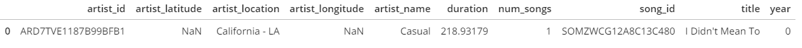
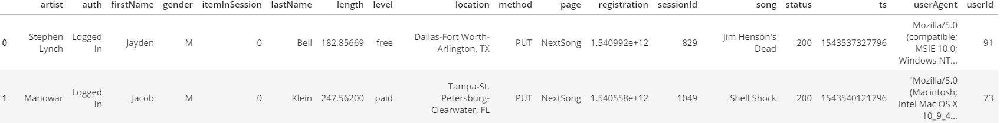

# Sparkify ETL Pipeline on PostgreSQL

## Backgroud:

Sparkify is using applcaition to stream the music. Sparkify wants to analyze their collected dataset to find out what songs users are listening to.

In this project, PostgreSQL was used to store data and using Python with psycopg2 to connect to database and create database schema then using Pandas Library to read JSON dataset and create Dataframe to ETL pipeline and store data to Fact and Dimension tables below for querying the results.

### Dataset is available in JSON format, there are two dataset below: 

 

### DB Normalization to create Fact/Dimension table below:

### Project Template and Step to Bulid:

1. create_tables.py: First, create Sparkify database and establish connection. Then inilially drop all tables and ceate new tables.
2. sql_queries.py: Second, build the following functions to execute when "create_table.py" call.
    2.1 Drop Table Function
    2.2 Create Table Function
    2.3 Insert Data to each table.
    2.4 Query Song that was select from function in etl.py
3. etl.ipynb: Third, to create ETL process.(To read first row in dataset and extract/load to table to check that it works correctly.)
    3.1 Process the song data by read song files JSON files and create Dataframe then extrat and insert only value needed for songs_table and artists_table.
    3.2 Process the log data by read log files JSON files and create Dataframe then extrat and insert only value needed for users table and time table.
    3.3 Implement the query to select the same set of the title, artist_name and duration of song to find song_id and artist_id and extract data to insert into songplays_table.
4. test.ipynb: This file was built to checj whether the record was loaded to the table correctly.
5. elt.py: Use the code in etl.ipynb to create ETL pipeline to process all records in dataset and extract/load to all tables.
